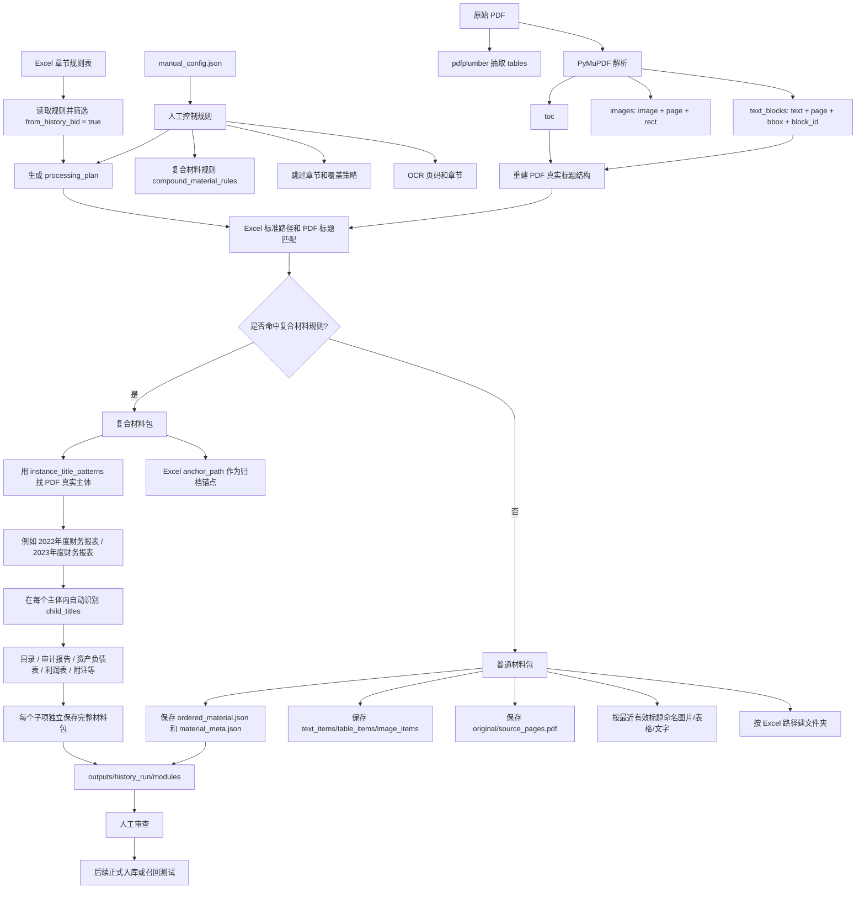

# 标书历史材料抽取流程

当前程序只保存 Excel 中“是否从往期投标文件中摘取”为“是”的内容。Excel 负责定义标准归档位置，PDF 负责提供真实材料标题、页码、图片、表格和正文。



## 当前抽取逻辑

1. Excel 是标准归档树。程序先只取 `from_history_bid = true` 的规则，不保存不可复用内容。
2. 普通章节按 Excel 路径建文件夹，再用 PDF 中最近的上方有效标题给文字、图片、表格命名。
3. 每个可复用章节都会生成完整材料包：`material_meta.json`、`ordered_material.json`、`original/source_pages.pdf`、`original/source_preview.png`、`text_items`、`table_items`、`image_items`。
4. 如果 PDF 中出现多个真实主体，而 Excel 只是一个归档锚点，就走复合材料包逻辑。
5. 复合材料包中，`instance_title_patterns` 负责识别主体，例如 `2022年度财务报表`；主体下面的子项由程序自动识别，不要求人工穷举。
6. `child_title_exclude_patterns` 用来过滤页眉、页码、公司名等噪声；`child_title_rename_map` 用来把不同叫法归一。

## 财务报表示例

标准归档锚点：

```text
商务文件 / 补充文件 / 财务状况 / 经会计师事务所或审计机构审计的财务会计报表
```

PDF 真实结构：

```text
2022年度财务报表/
  目录/
  审计报告/
  资产负债表/
  利润表/
  现金流量表/
  财务报表附注/

2023年度财务报表/
  目录/
  审计报告/
  资产负债表/
  利润表/
  ...
```

输出结构：

```text
modules/
  补充文件/
    财务状况/
      经会计师事务所或审计机构审计的财务会计报表/
        2022年度财务报表/
          目录/
          审计报告/
          资产负债表/
          利润表/
          财务报表附注/
        2023年度财务报表/
          目录/
          利润表/
          ...
```

核心原则：Excel 定归档位置，PDF 定真实材料实例，最近标题定材料名称，配置规则负责纠偏。
